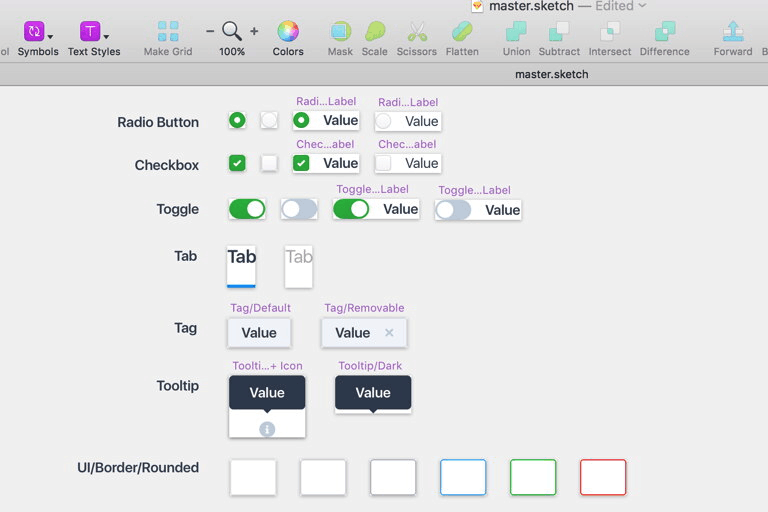
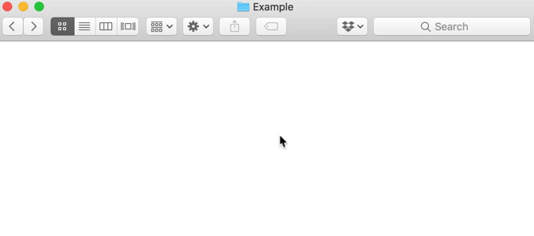

# Goodrocket Design

Sketch design system and folder structure for your next product design project.

## Sketch design system

**Well organized master sketch file ensuring good project scalability**

**Contains customizable component library based on nested symbol overrides**

**Comes with multiple text styles that can be easily redefined**

**Includes Styleguide page and several layout examples.**

---

## Folder structure

For increased productivity, I recommend using this folder structure together with [Alfred](https://www.alfredapp.com/) and [TemplatesManager workflow](http://www.packal.org/workflow/templatesmanager) or similar automation setup. 

The project consists of the following folders:

### Assets

- Design assets (fonts, json data, photography, etc.)
- Available design materials (e.g., logos, brand guidelines).
- Snapshot of current design (if there is one) for the record.

### Inspiration

- Competitor reviews, dribbble shots, etc.

### Design

- Snaps of whiteboard scribbles, paper sketches, etc.
- Wireframes & User flows
- Detailed designs.
- Styleguide, component library.

### Prototype

- Framer projects, InVision exports, handcoded HTML/CSS prototypes.
- Video recordings of the prototypes.

### Export

- Graphical assets for engineering.
